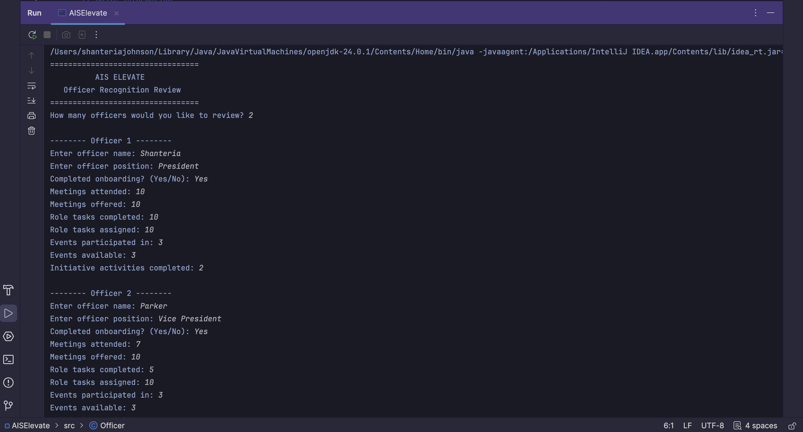
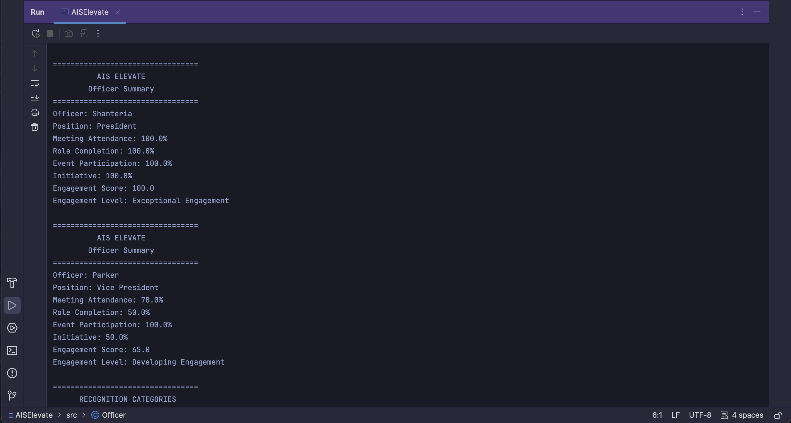
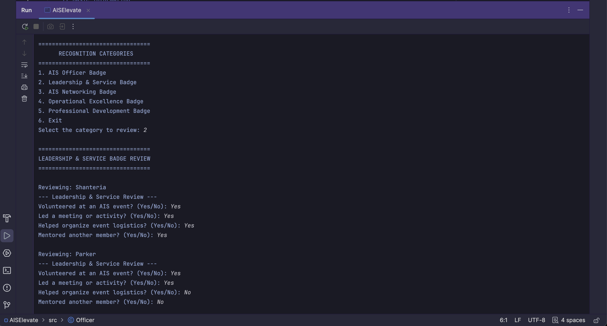
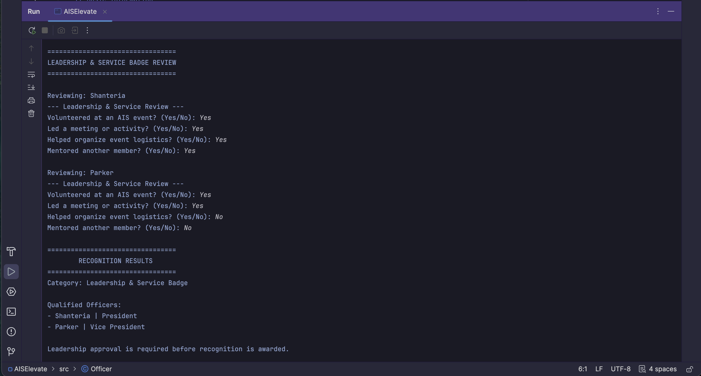

# AIS Elevate

## Officer Recognition & Analytics Platform

## Overview

AIS Elevate is a Java-based officer recognition and analytics platform designed for the Association for Information Systems (AIS) Student Chapter. The application transforms officer participation data into engagement insights and supports leadership by identifying officers who qualify for monthly recognition. This project is being developed as a long-term portfolio project and will continue to evolve throughout my Information Technology degree.

---

## Business Problem

AIS leadership currently tracks officer attendance in Excel, but there is no structured system for measuring engagement, evaluating officer contributions, or supporting monthly recognition decisions. Leadership must manually review participation and determine recognition without consistent metrics or analytics.

---

## Solution

AIS Elevate builds on the existing attendance tracker by calculating officer engagement, evaluating recognition criteria, and recommending officers who qualify for specific recognition categories. The system serves as a decision-support tool, allowing leadership to make informed and consistent recognition decisions while maintaining final approval authority.

---

## Features

- Officer engagement scoring
- Executive meeting attendance tracking
- Role completion analysis
- Event participation tracking
- Initiative contribution scoring
- Monthly recognition review workflow
- Officer Badge evaluation
- Leadership & Service Badge evaluation
- Networking Badge evaluation
- Operational Excellence Badge evaluation
- Professional Development Badge evaluation
- Object-oriented Java design

---

## Future Roadmap

### Version 1 – Java MVP ✅
- Officer engagement calculations
- Recognition review workflow
- Monthly badge evaluation

### Version 2 – SQL Database
- Store officer records
- Store recognition history
- Eliminate manual data entry

### Version 3 – Analytics Dashboard
- Officer engagement trends
- Recognition analytics
- Executive reporting

### Version 4 – AI Integration
- AI-generated recognition summaries
- Leadership insights
- Officer growth recommendations

### Version 5 – Predictive Analytics
- Engagement forecasting
- Leadership development trends
- Recognition recommendations based on historical data

## AI-Assisted Development Process

AIS Elevate was developed through an iterative design process using AI as a collaborative development and learning tool rather than a code generator.

Throughout the project, AI was used to brainstorm ideas, explain Java concepts, review object-oriented design decisions, and provide feedback on business requirements. Rather than accepting generated solutions as final, each feature was discussed, evaluated, and refined to ensure it aligned with the real-world needs of the AIS Student Chapter.

As the project evolved, the focus shifted from building a simple engagement tracker to designing a leadership recognition platform. This transition came from continuously questioning the workflow, challenging assumptions, and redesigning the system to better reflect how leadership would actually conduct monthly officer recognition reviews.

The development process emphasized:
- Identifying the business problem before writing code
- Designing the recognition workflow before implementation
- Translating organizational processes into software requirements
- Iteratively refining the system architecture through discussion and testing
- Learning Java concepts while applying them to a real-world project

AI served as a mentor and technical resource throughout development, while all business decisions, project direction, scoring models, recognition criteria, and system requirements were intentionally designed and refined by the developer.

## Application Workflow

### Welcome Screen

The application begins by collecting officer information for the monthly recognition review. Leadership enters officer participation data, which is used to calculate engagement metrics and support the recognition evaluation process.

---

### Officer Engagement Summary

AIS Elevate calculates each officer's engagement using executive meeting attendance, role completion, event participation, and initiative contributions. The system generates an overall engagement score and engagement level to provide leadership with a quick overview of officer performance.

---

### Monthly Recognition Review

Leadership selects one recognition category to evaluate during the monthly review. Each category contains its own set of business rules and requirements, allowing officers to be evaluated consistently for a specific type of contribution.

---

### Recognition Results

After evaluating all participating officers against the selected recognition criteria, AIS Elevate displays the officers who qualify for recognition. The system provides recommendations to support leadership decision-making while leaving the final recognition approval to the executive team.

