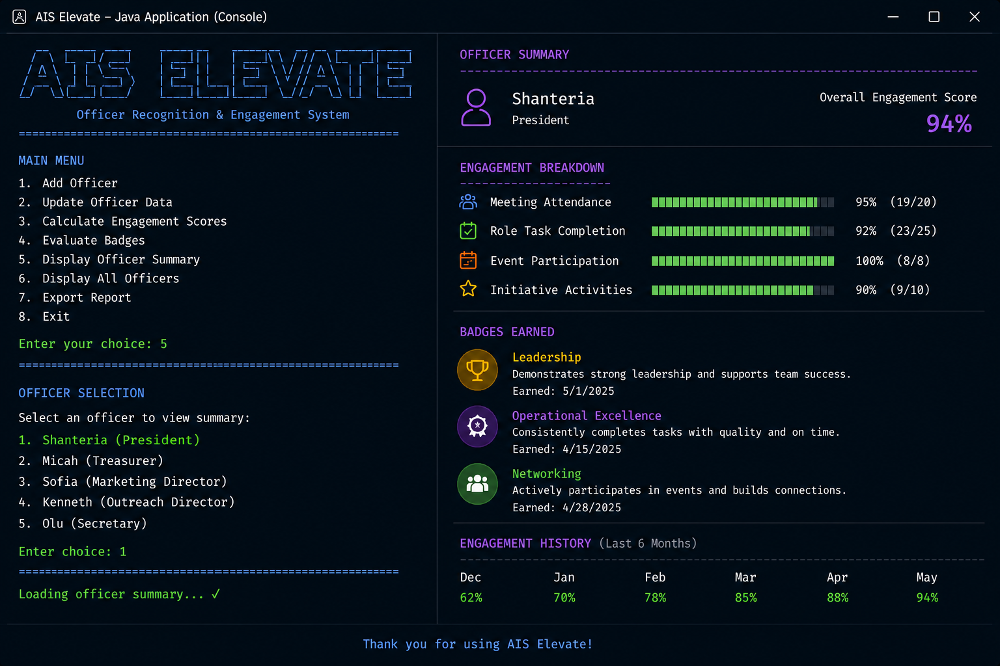

# AIS Elevate

## Officer Recognition & Analytics Platform

## Overview

AIS Elevate is a Java application created for the Association for Information Systems (AIS) Student Chapter. It helps leadership track officer participation, calculate engagement scores, and identify officers who qualify for monthly recognition. This project began as a class assignment and is continuing to grow as a long-term portfolio project throughout my Information Technology degree.

---

## Business Problem

AIS leaders currently use Excel to track officer attendance, but attendance alone does not show how engaged an officer is. There is also no consistent way to recognize officers for completing tasks, participating in events, or contributing beyond meetings. Leadership must review this information manually each month, making the recognition process time-consuming and inconsistent.

---

## Solution

AIS Elevate makes the recognition process easier by collecting officer participation data, calculating engagement scores, evaluating badge criteria, and recommending officers for recognition. Instead of relying only on spreadsheets, leadership can use the application to support fair and consistent recognition decisions while keeping the final approval process in their hands.

---

## Features

- Officer engagement scoring
- Executive meeting attendance tracking
- Role completion analysis
- Event participation tracking
- Initiative contribution scoring
- Monthly recognition review workflow
- Officer Badge evaluation
- Leadership & Service Badge evaluation
- Networking Badge evaluation
- Operational Excellence Badge evaluation
- Professional Development Badge evaluation
- Object-oriented Java design

---

## Development Roadmap

### Version 1 – Java MVP 
- Officer engagement calculations
- Recognition review workflow
- Monthly badge evaluation

### Version 2 – SQL Database
- Store officer records
- Store recognition history
- Reduce manual data entry

### Version 3 – Analytics Dashboard
- Officer engagement trends
- Recognition analytics
- Executive reporting

### Version 4 – AI Decision Support
- AI-generated recognition summaries
- Leadership insights
- Officer growth recommendations

### Version 5 – Predictive Analytics
- Engagement forecasting
- Leadership development trends
- Recognition recommendations based on historical data

---

## AI-Assisted Development Process

AIS Elevate was developed over several stages using AI as a learning and development assistant rather than a code generator.

Throughout the project, AI helped brainstorm ideas, explain Java concepts, improve the application's design, organize documentation, and refine business requirements. Instead of accepting AI-generated suggestions as final solutions, every feature was reviewed, tested, and improved to make sure it met the real needs of the AIS Student Chapter.

As the project grew, it evolved from a simple engagement tracker into a leadership recognition platform. This happened by continuously improving the workflow, refining the scoring system, and redesigning features to better support the monthly recognition process.

The development process focused on:

- Understanding the business problem before writing code
- Designing the recognition workflow before implementation
- Turning organizational processes into software requirements
- Improving the system through testing and feedback
- Learning Java while building a real-world application

AI served as a learning partner and technical resource throughout development. However, all business decisions, scoring models, recognition criteria, system requirements, and final implementation were designed, reviewed, and completed by the developer.

---

## Application Workflow

### Welcome Screen

The application begins by collecting officer information for the monthly recognition review. Leadership enters participation data, which is used to calculate engagement scores and support the recognition process.

---

### Officer Engagement Summary

AIS Elevate calculates each officer's engagement using meeting attendance, role completion, event participation, and initiative contributions. The application then generates an overall engagement score and engagement level to give leadership a quick summary of each officer's performance.

---

### Monthly Recognition Review

Leadership selects a recognition category to evaluate during the monthly review. Each category has its own requirements, allowing officers to be evaluated consistently based on their contributions.

---

### Recognition Results

After all participating officers have been evaluated, AIS Elevate displays the officers who qualify for recognition. The application provides recommendations to support leadership, while the executive team makes the final recognition decision.

---

# Future Interface Concept

The current version of AIS Elevate is a fully functional Java console application. As the project continues to grow, the goal is to develop a modern desktop interface while keeping the same business logic and recognition workflow.

The image below shows a concept of what a future version of AIS Elevate could look like. It is a design mockup and is **not part of the current implementation**.

*Conceptual desktop interface showing the long-term vision for AIS Elevate, including engagement tracking, officer management, and recognition analytics.*

---

## Live Website

AIS Elevate extends beyond the Java application with a professional project website and an interactive live demonstration.

As a Data Science & Analytics student and President of the Association for Information Systems (AIS) Student Chapter, I created AIS Elevate to demonstrate how software engineering and data analytics can transform participation into meaningful insights. While inspired by student leadership, the platform can also be adapted for businesses to improve employee engagement, recognize high-performing employees, measure participation, and support data-driven management decisions.

### Project Links

**Website:** https://aiselevate.my.canva.site/website

**Interactive Live Demo:** https://aiselevate.my.canva.site/

### Design & Development Process

The website and interactive demonstration were designed using Canva Websites and Canva Code to showcase the project in a modern, user-friendly format. The design process focused on creating a software product experience rather than a traditional class project presentation.

The development process included:

- Planning the user experience and website structure
- Designing a responsive software landing page
- Creating high-fidelity UI mockups
- Developing an interactive prototype with Canva Code
- Integrating live engagement scoring and reporting features
- Refining the interface through iterative design improvements

### What You'll Find

- Project overview and business problem
- Interactive live demonstration
- Engagement scoring and badge system
- Monthly reporting demonstration
- Technology stack
- Project documentation
- Future enhancements

The interactive live demo allows visitors to enter sample participation data, calculate engagement scores, generate recognition badges, and generate monthly reports to experience the platform firsthand.
